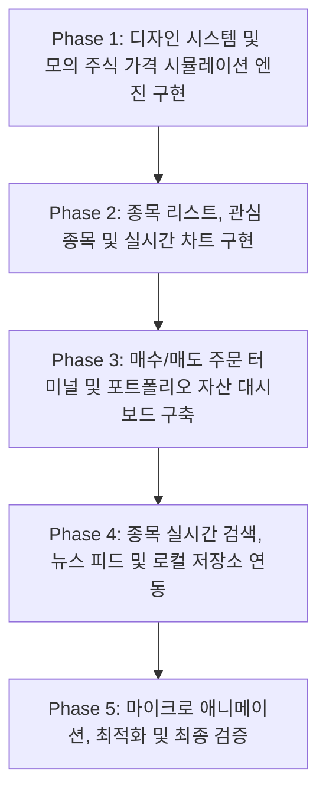

# 제품 요구사항 정의서 (PRD) - 프리미엄 주식 트래커 및 시뮬레이터

## 1. 개요
프리미엄급의 대화형 주식 모의 투자 및 포트폴리오 관리 웹 애플리케이션입니다. 사용자에게 실시간 가상 주가 흐름을 시각적으로 제공하고, 대화형 역사적 주가 차트, 모의 투자 시스템, 자산 가치 및 손익(P&L)을 모니터링할 수 있는 완성도 높은 금융 대시보드를 구축하는 것을 목표로 합니다.

---

## 2. 주요 기능

### 2.1. 주식 관심 종목 및 라이브 대시보드
- **시장 개요**: 주요 주식 종목(예: NVDA, AAPL, TSLA, MSFT, AMZN 등)의 티커, 회사명, 현재가, 전일 대비 등락률(%) 및 등락액($)을 보여주는 리스트 구성.
- **관심 종목(Watchlist)**: 사용자가 원하는 주식을 관심 종목 리스트에 추가하거나 삭제하여 모니터링할 수 있는 기능.
- **스파크라인(Sparklines)**: 대시보드 카드 내에서 지난 24시간 동안의 주가 흐름을 한눈에 알 수 있는 간결한 미니 선 차트 표시.

### 2.2. 대화형 차트 (Interactive Charting)
- **주가 차트**: Chart.js 라이브러리를 활용하여 반응형이며 인터랙티브한 주가 라인 차트 렌더링.
- **기간 선택기 (Timeframe Selector)**: 1일(1D), 1주일(1W), 1개월(1M), 1년(1Y) 등 조회 기간을 자유롭게 전환 가능.
- **인터랙티브 툴팁**: 차트 영역에 마우스를 올리면(호버) 해당 시점의 정확한 주가와 날짜/시간 정보를 팝업으로 노출.

### 2.3. 모의 투자 시뮬레이터 (Portfolio Manager)
- **초기 자본금**: 가입 시 $10,000 USD의 가상 투자금 지급 (임의 설정 가능).
- **매수 / 매도 주문**: 실시간 시뮬레이션 주가에 맞춰 시장가 매수/매도 주문을 체결. 총 구매 금액, 잔여 현금, 보유 주식 수량 및 평균 매수가가 즉시 계산됨.
- **포트폴리오 요약 카드**: 실시간으로 자산 변동 상태 요약:
  - **순자산 가치 (NAV)**: 보유 현금과 보유 주식 가치의 총합.
  - **총 손익 (P&L)**: 달러($) 금액 및 퍼센트(%) 수익률을 실시간 표기.
  - **자산 배분**: 현금 대비 주식 보유 비중을 직관적으로 보여주는 시각적 인디케이터 제공.
- **거래 내역 (Transaction History)**: 과거 체결된 모든 매수/매도 주문 이력(티커, 액션, 수량, 체결가, 거래 시간)을 기록하는 원장 제공.

### 2.4. 실시간 종목 검색
- 종목 코드(예: "AAPL") 또는 회사 이름(예: "Apple")을 입력하면 실시간으로 주식 목록을 필터링하여 검색.

### 2.5. 주식 시장 뉴스 피드
- 주요 종목별 또는 시장 전체의 중요 금융 뉴스 카드 피드 제공 (헤드라인, 발행사, 작성 시간 포함).

### 2.6. 로컬 데이터 영속성
- 관심 종목 목록, 포트폴리오 보유 현황, 현금 잔고 및 거래 내역을 브라우저의 `localStorage`에 자동 보관하여 새로고침 시에도 유지.

---

## 3. Design Aesthetics 및 UX (Premium Standards)

- **색상 팔레트**: 세련된 블랙 및 딥 차콜 다크 모드를 기본으로 채택. 주가 상승 시 밝게 빛나는 네온 에메랄드 그린, 하락 시 핫 로즈/레드 컬러를 사용하여 금융 플랫폼 특유의 긴장감과 시인성 극대화.
- **글래스모피즘(Glassmorphism)**: 투명도 높은 카드 레이아웃(`backdrop-filter: blur(20px)`)과 얇고 미세한 테두리 광원 효과를 적용하여 레이어드 디자인 연출.
- **타이포그래피**: 숫자의 정렬과 가독성이 우수한 프리미엄 산세리프 폰트 **Inter** 또는 **Plus Jakarta Sans** 사용.
- **마이크로 애니메이션**:
  - 주가 시뮬레이션 업데이트 발생 시 숫자가 에메랄드 그린/로즈 레드로 미세하게 깜빡(Blink)이는 연출.
  - 차트 기간 변경 시 선이 부드럽게 새로 그려지는 드로잉 애니메이션.
  - 거래 내역 추가 및 버튼 마우스 호버 시 부드러운 스케일 및 색상 변환 효과.

---

## 4. 기술 스택

- **코어 (Core)**: Vanilla HTML5, modern ES6+ JavaScript.
- **스타일 (CSS)**: Vanilla CSS3 (CSS Grid/Flexbox 레이아웃, 변수 및 애니메이션 설정).
- **시각화 (Visuals)**: Chart.js (CDN 연동).
- **아이콘**: Lucide Icons (CDN 연동).
- **데이터 소스**: 브라우저 백그라운드에서 임의로 가격 변동 흐름(Random Walk 모델 기반)을 생성해 내는 가상 주식 가격 시뮬레이션 엔진 설계.

---

## 5. 개발 단계

### Phase 1: 기반 다지기 & 주가 엔진
- CSS 변수를 이용한 디자인 토큰 구축. JS를 사용해 백그라운드에서 실시간으로 가격 변동을 연산하는 가상 주가 엔진 구현.

### Phase 2: 차트 & 리스트 화면
- Chart.js를 연동하고, 기간별 주가 차트 렌더링 및 관심종목 추가/삭제 컴포넌트 개발.

### Phase 3: 투자 터미널 & 자산 대시보드
- 실시간 가격 기준의 매수/매도 폼, 체결 처리 로직, 순자산 가치 계산 및 자산 배분 비중 UI 구현.

### Phase 4: 검색 & 뉴스 & 영속성
- 주식 종목 검색 및 맞춤 뉴스 카드 렌더링. `localStorage` 연동으로 브라우저 리로드 시에도 투자 상태 보존.

### Phase 5: 인터랙티브 연출 & 검증
- 주가 갱신 시 숫자가 깜빡이는 깜빡임 애니메이션, 모바일 호환성 검증 및 전체 UX 마감 처리.
